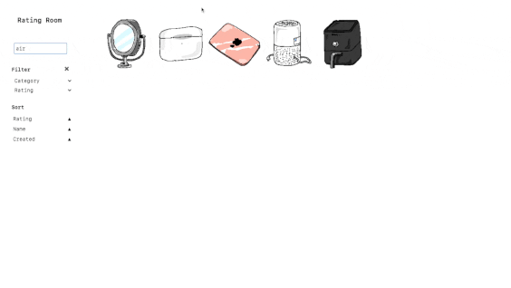
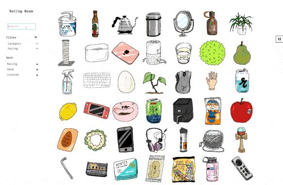

# Rating Room

## About

This project is a collaborative effort to catalogue and rate everything in existence.  
Written in `Svelte` with `TailwindCSS`, `Typescript`, and `Sanity`. Testing is implemented in `Jest` and `Playwright`.

## Usage

```js
npm run dev
```
Runs client in `vite`.

```bash
yarn test:unit
yarn test
```
Testing: Unit tests run in `Jest`, integration tests run in `Playwright`.

## Functionality

Home Page and Product View

Live Product Searching

Filtering/Sorting


